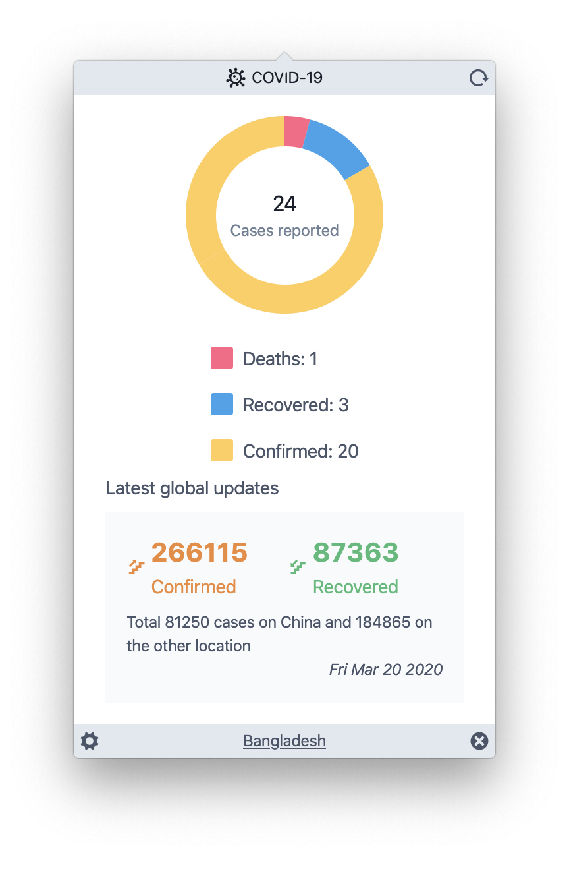

<p align="center">
  
</p>

<h1 align="center">CORONA: COVID-19</h1>
A desktop tray application based on Electron and VueJS to stay up to date with the latest Corona: COVID-19 virus information.

## Why?
Coronavirus isn't just a regular flu that will simply go away. It is 2020, the modern tech world and we are still struggling to protect our family against this.

As soon as I saw the [COVID-19 API](https://github.com/mathdroid/covid-19-api), I have decided to make something simple. This will not only help people to get the information but will also help me to learn new technologies.

## Interface
It's not that much but wanted to make something simple and lightweight using [Tailwind CSS](https://tailwindcss.com).
<p align="center">
  
</p>

## Features
I have always wanted to keep the app simple to make sure it loads faster (as we all know Electron is a resource heavy technology) but still get the most out of the data.

 - Total deaths
 - Total reported case
 - Total confirmed case
 - Sum of total reported case
 - Latest global confirmed case
 - Latest global recovered case
 - Automatic current country detection
 - Switch between countries to see the total affected numbers
 - Offline support when internet connection isn't available
 - Auto launch on system reboot
 - Refresh the data to get the most recent update

 ## Download
 Download can be performed for both of the Mac, Windows, and Linux operating systems directly from the [releases](https://github.com/mazik/corona/releases) section.

## Caution

The source codes are bit of nasty and there's no unit test for the app as I wanted to make something very quickly. So, there's a lot of places for improvements. So, if you do look at the source code, please do feel free to send a pull request :)

When installing the app, you may see warning from your operating system. You can safely ignore this as the warning is only because the app wasn't signed as code signing requires 💵.

## Project setup
```shell
yarn install
```
### Compiles and hot-reloads for development
```shell
yarn electron:serve
```
### Compiles and minifies for production
```shell
yarn electron:build
```
### Run your unit tests
```shell
yarn test:unit
```
### Run your end-to-end tests
```shell
yarn test:e2e
```
### Lints and fixes files
```shell
yarn lint
```
